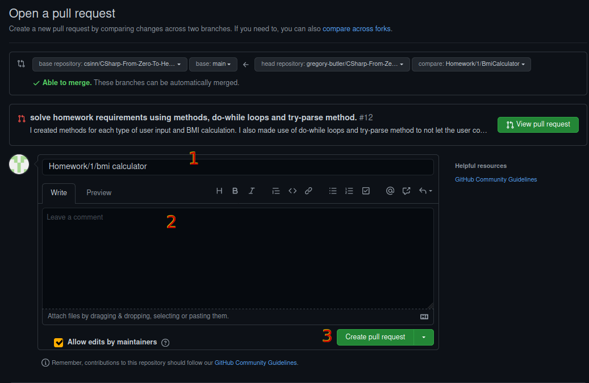

## Tutorial: Git & GitHub

1. Download and Install Git from https://git-scm.com/downloads
2. If you don't have an GitHub account create one here https://github.com/join
3. After you created your account login to GitHub and go to https://github.com/csinn/CSharp-From-Zero-To-Hero-v2 
>Here you will have to fork the repository. The "Fork" operation will create a copy of the CSharp-From-Zero-To-Hero-v2 to your GitHub account.<br>

<br>

4. Open a command line and configure git using:<br>
```bash
git config --global user.name "Your Name on GitHub"
git config --global user.email "email_used_on_github"
```
>If your account and email address from step 2 were "combowombo" and "combowombo@gmail.com" then the git config command should look like this:

```bash
git config --global user.name "combowombo"
git config --global user.email "combowombo@gmail.com"
```

5. Navigate to the a folder where you want to store your repository ( ex c:\my_repos)
6. got to your github account and select the previously forked repo 
7. click the code button and the copy button (clipboard shaped)


8. Go back to command line and type:
```bash
git clone
```
9. Paste the previously copied link... it shoud be somehting like
https://github.com/[your_github_account_name]/CSharp-From-Zero-To-Hero-v2.git
Command should look like this:<br>

```bash
git clone https://github.com/[your_github_account_name]/CSharp-From-Zero-To-Hero-v2.git
```
10. To create a new branch for the homework (I won't go in to details on what branches are but if you thought about the branches of a tree you are on the right track)
To do that locally you have the command:
```bash
git checkout -b "Homework/1/BmiCalculator"
```
11. Create or add your solution in current folder.
12. This command will obviously display the status of the local repo, and if you did things right it will show the new files marked in red:<br>

13. Before you commit (store your changes) you firstly need to add your new files to the staging area which is a kind of temporary workspace
```bash
git add .
```
>Using . (dot) will add all files to the staging arrea but you can add one file at a time if you wish.<br>


14. Now it's time to commit your changes
```bash
git commit -m "This is my commit message"
```
>It is recomended to give descriptive messages for your commits, in our case, with an empty project, "initial commit" would be a good message".
I found it is best to do commits in small steps, after small changes like refactoring block code in to a function, renaming a bunch of variables.

15. Now, how do we take our changes to the GitHup repository? Well we "push" them there:
```bash
git push
```
>At this step git might scream at you that you have no no upstream branch, but you can fix this by using the command:
```bash
git push --set-upstream origin Homewor/1/BmiCalculator
```
>It will also ask you for your GitHub user name and password.
>If everything went ok you will find that your project was uploaded on your GitHub repository.<br>


>### :exclamation: Notice that I misspeled homework in the above examples :exclamation:

>After you add your code you will have add your files to be tracked, commit, remember that is best to do it in small incremental steps, push it to GitHub.

16. There is one more step required to get your code to the main repository, you will have to create a PR (pull request) on GitHub from your repository to the source repository.




>This is how it should look on the web page<br>
1 - is the title/name of the PR; it should describe the PR in one sentence<br>
2 - actual details of the PR<br>
3 - click it when you are done writing 1 and 2

>### Good resources:
>[How to write good commit message](https://chiamakaikeanyi.dev/how-to-write-good-git-commit-messages/)<br>
[How to write the perfect pull request](https://github.blog/2015-01-21-how-to-write-the-perfect-pull-request/)<br>
